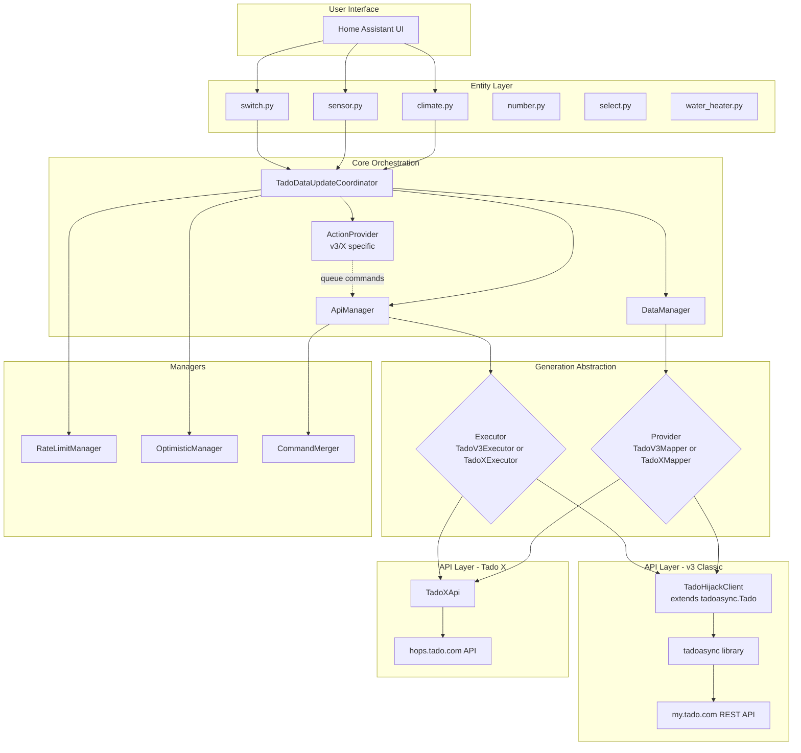
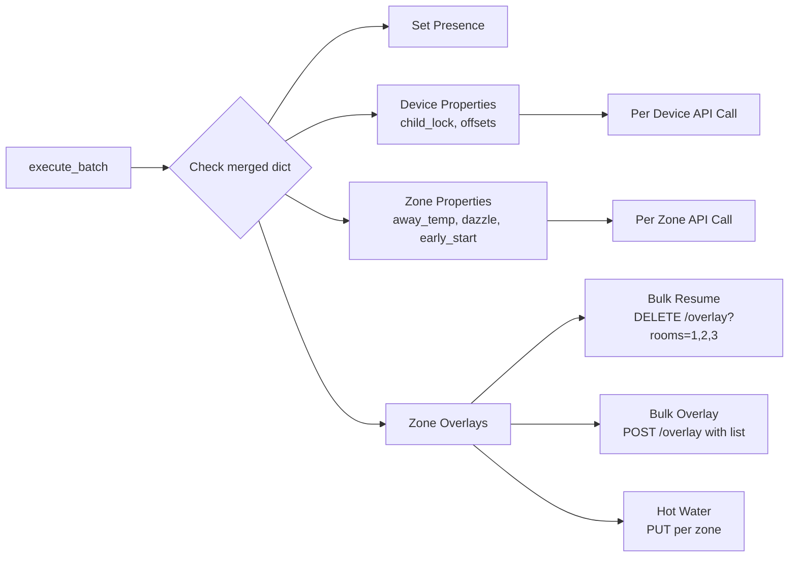
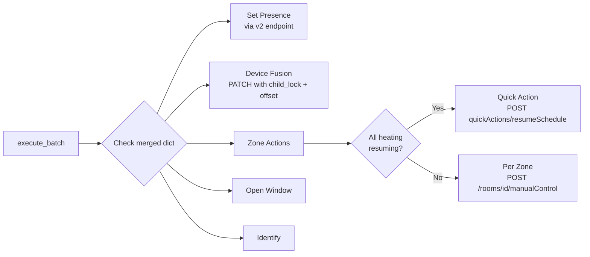
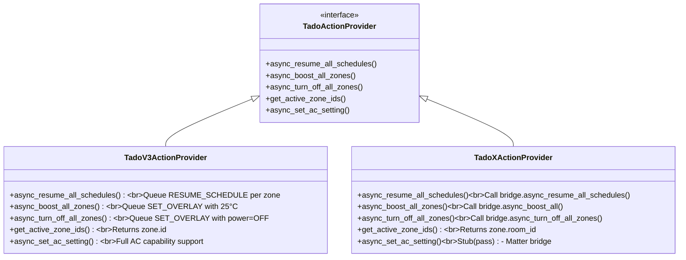

# Multi-Generation Architecture

Complete technical overview of Tado Hijack's unified architecture supporting both Tado v3 Classic and Tado X.

---

## Overview

Tado Hijack supports three distinct hardware generations through a **unified polymorphic architecture**:

- **Tado V2** - GW bridges (legacy), uses tadoasync library for my.tado.com API, Full Cloud Mode only
- **Tado V3 Classic** - IB01/GW01 bridges, uses tadoasync library for my.tado.com API
- **Tado X** - IB02 Bridge X, uses custom TadoXApi for hops.tado.com API

### Generation Detection

Generation is **selected by user during setup** (not auto-detected), stored in config, and determines which provider is initialized. V2/V3 are bundled in config flow (same API) and use the GEN_CLASSIC constant internally.

```python
# coordinator.py:125-145
if self.generation == GEN_X:
    tadox_bridge = TadoXApi(self.client)
    self.provider = TadoXMapper(tadox_bridge)
else:  # GEN_CLASSIC
    self.provider = TadoV3Mapper(self.client)
```

---

## Architecture Diagram



---

## Provider Pattern (Polymorphism)

Both providers implement the same interface, allowing coordinator to be generation-agnostic:

```python
# Unified interface (duck typing, no formal Protocol)
async def async_fetch_zones() -> dict[str, ZoneState]:
    """Fetch zone states (temperature, power, overlay)"""

async def async_fetch_metadata() -> tuple[dict, dict]:
    """Fetch zones and devices metadata"""

async def async_fetch_home_state() -> HomeState | None:
    """Fetch home presence state"""

def is_feature_supported(feature: str) -> bool:
    """Check if feature is supported by this generation"""

def get_bridge_device_types() -> set[str]:
    """Return bridge types for this generation"""
```

### Implementation Differences

| Method | v3 Classic | Tado X |
|--------|------------|---------|
| `async_fetch_zones` | `client.get_zone_states()` | `bridge.async_get_room_states()` |
| `async_fetch_metadata` | `client.get_zones()` + `client.get_devices()` | `bridge.async_get_rooms_and_devices()` |
| `async_fetch_home_state` | `client.get_home_state()` | `None` (embedded in metadata) |
| `is_feature_supported("dazzle_mode")` | `True` | `False` |
| `is_feature_supported("early_start")` | `True` | `False` |
| `get_bridge_device_types` | `{IB01, GW01}` | `{IB02}` |

---

## Data Model Unification

Both generations map to the same unified container:

```python
# models_unified.py
@dataclass
class UnifiedTadoData:
    api_status: str
    home_state: Any                      # v3: HomeState, X: {"presence": str}
    zone_states: dict[str, Any]          # ZoneState or TadoXZoneState
    zones: dict[int, Any]                # Zone or HopsRoomSnapshot
    devices: dict[str, Any]              # Device or TadoXDevice
    capabilities: dict[int, Any]         # v3 only
    offsets: dict[str, TemperatureOffset]
    away_config: dict[int, float]       # v3 only
    generation: str                      # GEN_CLASSIC or GEN_X
    rate_limit: RateLimit
    limit: int
    remaining: int
```

### Duck Typing Strategy

Code accesses attributes that exist on both model types:

```python
# Works for both v3 Zone and Tado X HopsRoomSnapshot
zone_id = zone.id if hasattr(zone, 'id') else zone.room_id
zone_name = zone.name  # Both have this

# Works for both ZoneState and TadoXZoneState
temp = state.setting.temperature.celsius
power = state.setting.power
```

---

## Generation-Specific Executors

### TadoV3Executor (helpers/tadov3/executor.py)



**Key Features:**
- Bulk zone operations (1 call for multiple zones)
- Separate calls for device/zone properties
- Hot water zones handled individually

### TadoXExecutor (helpers/tadox/executor.py)



**Key Features:**
- Quick Actions for house-wide operations (1 call)
- Device property fusion (child_lock + offset in one PATCH)
- No bulk overlay support (per-zone manual control)
- Falls back to Quick Actions when possible

---

## Action Provider Pattern

Generation-specific commands are routed through action providers:



### Critical Difference

- **v3**: Zone ID is `zone.id` (integer)
- **Tado X**: Zone ID is `zone.room_id` (integer)
- Both use integer keys, but attribute names differ

---

## API Layer Architecture

### v3 Classic: TadoHijackClient

Extends `tadoasync.Tado` with custom methods:

```python
class TadoHijackClient(Tado):
    # Override for robust request handling
    async def _request(...):
        return await TadoRequestHandler.robust_request(...)

    # v3 Bulk API methods
    async def reset_all_zones_overlay(zones: list[int]):
        """DELETE /homes/{id}/overlay?rooms=1,2,3"""

    async def set_all_zones_overlay(overlays: list[dict]):
        """POST /homes/{id}/overlay with list"""

    # Device/Zone property methods
    async def set_temperature_offset(serial, offset)
    async def set_child_lock(serial, enabled)
    async def set_away_configuration(zone_id, temp, ...)
    async def set_dazzle_mode(zone_id, enabled)
    async def set_early_start(zone_id, enabled)
```

### Tado X: TadoXApi

Custom implementation using tadoasync's session/auth:

```python
class TadoXApi:
    def __init__(self, tado_client: Tado):
        self._tado = tado_client
        self._session = self._tado._ensure_session()  # Reuse auth

    async def _request(method, endpoint, ...):
        await self._tado._refresh_auth()  # OAuth refresh
        headers = {"Authorization": f"Bearer {self._tado._access_token}"}
        url = f"https://hops.tado.com/homes/{self._tado._home_id}/{endpoint}"
        # Add ngsw-bypass=true to bypass service worker cache

    # Hops API endpoints
    async def async_get_rooms_and_devices()  # GET roomsAndDevices
    async def async_get_room_states()         # GET rooms
    async def async_set_manual_control(...)   # POST rooms/{id}/manualControl
    async def async_resume_schedule(room_id)  # DELETE rooms/{id}/manualControl

    # Quick Actions (bulk operations)
    async def async_boost_all()               # POST quickActions/boost
    async def async_resume_all_schedules()    # POST quickActions/resumeSchedule
    async def async_turn_off_all_zones()      # POST quickActions/allOff
```

**Private Attribute Coupling:**
- Accesses: `_ensure_session()`, `_refresh_auth()`, `_access_token`, `_home_id`
- Documented for upstream contribution (see dev/workspace/context/tadoasync_coupling.md)

---

## tadoasync Patches

Runtime modifications to tadoasync for compatibility (lib/patches.py):

```python
def patch_zone_state_deserialization():
    """Fix ZoneState deserialization issues"""
    # Problem 1: API returns null for nextTimeBlock
    # Solution: Convert null to empty dict

    # Problem 2: Hot water activity data location
    # Solution: Rescue from overlay.activity to state.activity
```

Applied once at integration startup, idempotent.

---

## Feature Matrix

| Feature | V2 | V3 Classic | Tado X | Implementation |
|---------|-----|-----------|--------|----------------|
| **Temperature Control** | ☁️ Cloud only | ☁️ or 🏠 HomeKit | 🏠 Matter | V2: Full Cloud Mode required |
| **Zone Polling** | ✅ 1 call | ✅ 1 call | ✅ 1 call | Unified via provider |
| **Metadata Polling** | ✅ 2 calls | ✅ 2 calls | ✅ 1 call | V2/V3: zones + devices separate, X: combined |
| **Presence** | ✅ Separate poll | ✅ Separate poll | ✅ In metadata | Different update patterns |
| **Bulk Resume** | ✅ 1 call | ✅ 1 call | ✅ 1 call (Quick Action) | All support, different endpoints |
| **Bulk Boost/Off** | ✅ 1 call | ✅ 1 call | ✅ 1 call (Quick Actions) | All support, different endpoints |
| **Bulk set_mode_all** | ✅ 1 call | ✅ 1 call | ❌ N calls | V2/V3 bulk API, X per-zone |
| **Temperature Offset** | ✅ 1 call/device | ✅ 1 call/device | ✅ In metadata | V2/V3 individual GET, X embedded |
| **Away Temperature** | ✅ | ✅ | ❌ | V2/V3: separate endpoint |
| **Dazzle Mode** | ✅ | ✅ | ❌ | V2/V3: separate endpoint |
| **Early Start** | ✅ | ✅ | ❌ | V2/V3: separate endpoint |
| **Open Window** | ✅ | ✅ | ✅ | All support |
| **AC Settings** | ✅ Full support | ✅ Full support | ❌ Matter bridge | V2/V3: via capabilities, X: stub |
| **Device Fusion** | ❌ Separate calls | ❌ Separate calls | ✅ PATCH combined | X: child_lock + offset in one call |
| **API Quota** | ~20k calls/day | 1k calls/day (dropping to 100) | 1k calls/day (dropping to 100) | V2 viable for cloud polling |

---

## Generation-Aware Entity Filtering

Entities use `supported_generations` to control availability:

```python
# definitions.py
create_zone_switch(
    key="early_start",
    is_supported_fn=lambda c, zid: c.generation == GEN_CLASSIC
)

create_zone_select(
    key="fan_speed",
    supported_generations={GEN_CLASSIC}  # AC settings v3 only
)
```

---

## Bridge Device Filtering

Each generation filters devices to prevent cross-contamination:

```python
# coordinator.py: _update_devices()
bridge_types = self.provider.get_bridge_device_types()

for device in self.data.devices.values():
    if device_type in bridge_types:
        # This is our generation's bridge
```

**Result:** V2/V3 integration only sees GW/IB01/GW01, Tado X only sees IB02.

---

## Summary

The multi-generation architecture achieves full support for Tado V2, V3 Classic, and Tado X through:

1. **Provider Polymorphism** - Unified data fetching interface
2. **Executor Routing** - Generation-specific command execution
3. **Duck Typing** - Compatible data models with different attributes
4. **Feature Flags** - Generation-aware entity filtering
5. **API Abstraction** - Clean separation between my.tado.com and hops.tado.com
6. **Full Cloud Mode** - Optional climate entities via cloud polling (V2/V3 only)
   - **V2 (GW bridges)**: Only option for climate control (~20k calls/day makes it viable)
   - **V3 (IB01/GW01)**: Not recommended (1k calls/day dropping to 100, use HomeKit instead)
   - **Tado X**: Not recommended (1k calls/day dropping to 100, use Matter instead)

All generation-specific logic is isolated in `helpers/tadov3/` (Classic API for V2/V3) and `helpers/tadox/` (Hops API for Tado X) directories, with the coordinator remaining generation-agnostic.
