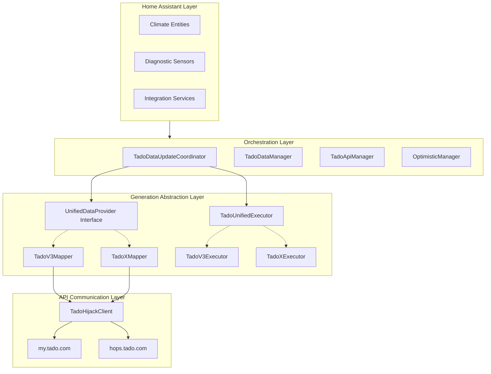

# Multi-Generation Architecture

Tado Hijack is built on a modular, generation-aware architecture. It abstracts the significant differences between Tado's classic V2/V3 hardware and the newer Tado X generation into a unified data model.

---

## 🏗️ Architectural Layers

---

## 🧠 The Orchestration Core

### `TadoDataUpdateCoordinator`
The central brain of the integration. It initializes all sub-managers and determines the hardware generation during setup. It holds the `UnifiedTadoData` which is the single source of truth for all entities.

### `TadoDataManager`
Handles the complexity of multi-track polling. It maintains separate caches for:
- **Zone States:** Current HVAC modes and temperatures.
- **Metadata:** Zone names and device lists.
- **Capabilities:** Hardware-specific features (AC modes, Temp ranges).
- **Settings:** Offsets and Away temperatures.

---

## 🔄 Generation Abstraction

Tado Hijack uses a polymorphic design to handle the shift from the legacy Classic API to the new Hops API used by Tado X.

### Data Fetching: `UnifiedDataProvider`
This interface ensures that regardless of the API structure, the integration receives data in a standardized format.
- **TadoV3Mapper:** Parses Classic API responses (where temperatures are in `.celsius`).
- **TadoXMapper:** Parses Hops API responses (where temperatures are in `.value`).

### Command Execution: `TadoActionProvider`
Abstracts write operations.
- **V3 Executor:** Uses `POST /overlay` for Classic devices. Supports AC Pro and Hot Water.
- **X Executor:** Uses `POST /hops/...` endpoints. Optimized for Bridge X architecture.

---

## 🔗 Device Unification & Resolution

### `EntityResolver`
A specialized utility that bridges the gap between Tado's Cloud and Home Assistant's local registry.
- **V3 (HomeKit):** Matches Tado devices via **Serial Number**. It injects cloud-only entities (Child Lock, Battery) into existing HomeKit device entries.
- **Tado X (Matter):** Since Matter devices hide serial numbers, the integration creates dedicated Tado Hijack devices. Users can manually link these via **Dynamic Source Selection**.

### Duck Typing Strategy
To minimize generation-specific `if/else` logic, the codebase heavily utilizes Python's `getattr()` for data model access. This allows the integration to gracefully handle missing or renamed keys across Tado's various API iterations.
