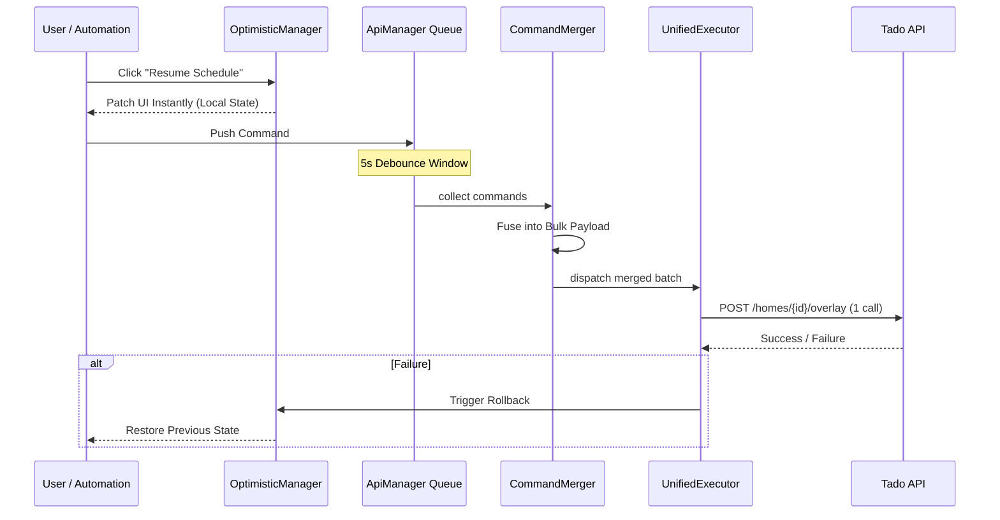
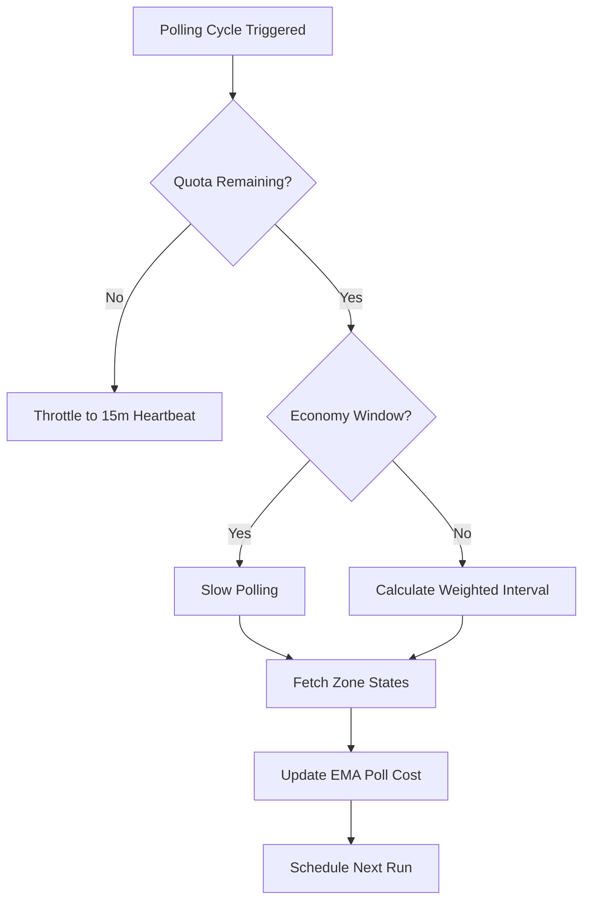

# System Design & Pipelines

Tado Hijack is engineered for maximum responsiveness and extreme quota efficiency. This document details the internal logic of how commands are processed and how polling is optimized.

---

## ⚡ Command Execution Pipeline

All state-changing actions follow a non-blocking, asynchronous pipeline.

### 1. Instant Feedback (Optimistic UI)
To avoid the "laggy UI" feeling common with cloud integrations, the `OptimisticManager` immediately patches Home Assistant's internal state. When you change a temperature, the slider stays where you put it, even while the command is still in the queue.

### 2. Command Fusion (Batching)
The `CommandMerger` is the heart of our quota-saving strategy. If you turn off all 10 radiators in your house, Tado Hijack does **not** send 10 API calls. It waits for a short debounce window (5s), collects all 10 intents, and fuses them into a single `POST` request to Tado's bulk overlay endpoint.

---

## 📊 Polling & Quota Management

The integration uses an adaptive polling engine that ensures your smart home stays informed without exhausting your daily API budget.

### Polling Logic Flow

### Auto API Quota Mechanics
- **Weighted Intervals:** The system calculates the polling frequency based on your remaining quota and the time until the next reset.
- **EMA Smoothing:** The integration measures the "cost" (API calls) of each polling cycle and uses an Exponential Moving Average (EMA) to predict future consumption.
- **Safety Reserve:** 2 calls are strictly reserved for the learned "Reset Window" to bridge the gap when Tado resets your account (typically ±1h around 12:00 Berlin time).

---

## 🛡️ State Integrity & Safety

### Field Locking
To prevent race conditions, the integration "locks" entity attributes that are currently being changed by the user. If an incoming background poll contains "old" data from before the user's action, the integration discards that specific field until the user's action is confirmed by the server.

### Threshold Throttling
The `RateLimitManager` enforces a "Throttle Threshold" (default: 20 calls). If your quota drops to this level, all background polling stops instantly. This ensures that your manual actions and critical automations (like turning off the heating when you leave) still have enough quota to execute.
