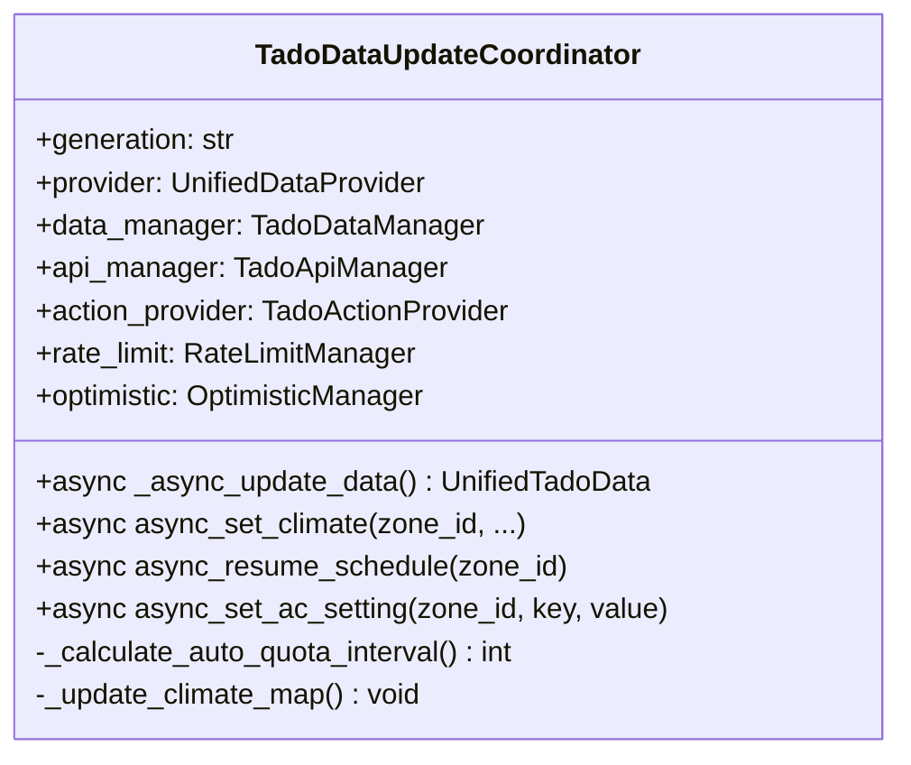
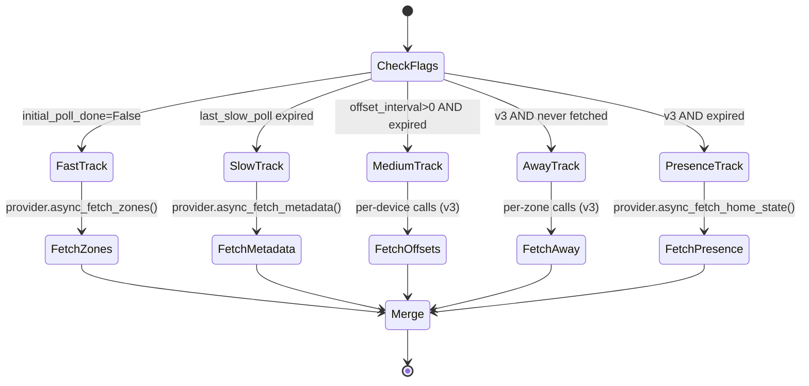
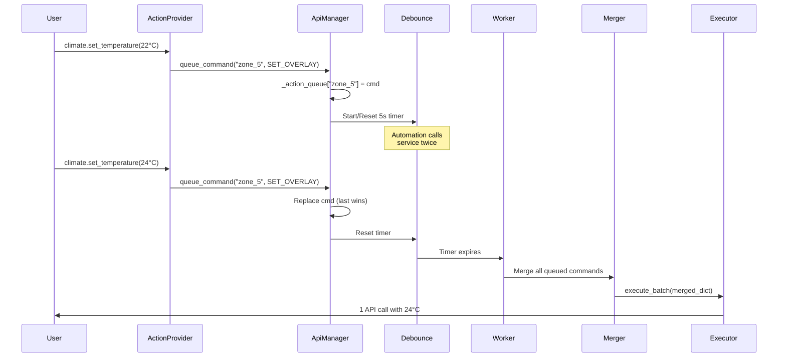
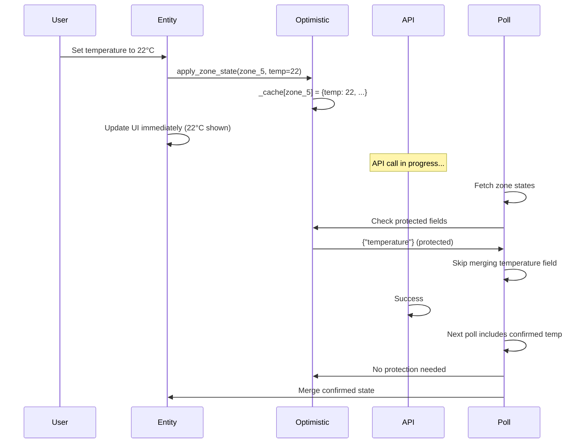

# System Design & Pipeline

Deep dive into Tado Hijack's internal design, execution flow, and specialized managers.

---

## System Pipeline Overview

```mermaid
flowchart TB
    subgraph Polling["Data Polling Pipeline"]
        Timer[Interval Timer] --> CoordUpdate[Coordinator._async_update_data]
        CoordUpdate --> GuardCheck{Throttled?<br/>Disabled?}
        GuardCheck -->|No| DataMgr[DataManager.fetch_full_update]
        GuardCheck -->|Yes| Skip[Skip Poll]

        DataMgr --> BuildPlan[Build Poll Plan]
        BuildPlan --> FastTrack[Fast Track<br/>Zone States]
        BuildPlan --> SlowTrack[Slow Track<br/>Metadata]
        BuildPlan --> MedTrack[Medium Track<br/>Offsets v3]
        BuildPlan --> AwayTrack[Away Track<br/>v3 only]

        FastTrack --> Provider[Provider.async_fetch_zones]
        SlowTrack --> Provider2[Provider.async_fetch_metadata]

        Provider --> Merge[Merge with Protection]
        Provider2 --> Merge
        Merge --> Update[Update Unified Data]
        Update --> Listeners[Notify Entities]
    end

    subgraph Commands["Command Execution Pipeline"]
        UserAction[User Action] --> ActionProv[ActionProvider.queue_command]
        ActionProv --> ApiQueue[ApiManager.queue_command]
        ApiQueue --> Debounce[Debounce Timer]
        Debounce --> Worker[Worker Loop]
        Worker --> MergeCmd[CommandMerger.merge]
        MergeCmd --> Exec[Executor.execute_batch]
        Exec --> SafeExec[_safe_execute with rollback]
        SafeExec --> API[API Call]
        API -->|Success| OptUpdate[Update Optimistic State]
        API -->|Failure| Rollback[Rollback State]
        OptUpdate --> ListenersCmd[Notify Entities]
    end
```



---

## Core Managers

### 1. TadoDataUpdateCoordinator

**File:** `coordinator.py` (lines 110-1200+)

Central orchestrator managing the entire integration lifecycle.



**Key Responsibilities:**
- Initialize generation-specific providers and executors
- Orchestrate polling via DataManager
- Route commands via ApiManager
- Calculate dynamic polling intervals (Auto Quota)
- Manage rate limit tracking and throttling
- Maintain entity mappings (zones, devices)

**Auto Quota Calculation** (lines 481-558):
```python
def _calculate_auto_quota_interval():
    # Priority order:
    # 1. Invalid limit → safety interval
    # 2. Throttled → recovery interval (15 min)
    # 3. Economy window → reduced/zero polling
    # 4. Auto quota disabled → None
    # 5. Budget exhausted → safety fallback
    # 6. Normal → calculate from remaining budget

    # Uses QuotaMath.calculate_interval(
    #     remaining, hours_left, target_percent, weights
    # )
```

---

### 2. TadoDataManager

**File:** `helpers/data_manager.py` (lines 40-534+)

Orchestrates multi-track polling with independent lifecycle flags.



**Poll Plan Structure:**
```python
@dataclass
class PollTask:
    track_name: str        # "fast", "slow", "medium", "away", "presence"
    cost: int              # API calls consumed
    fetch_fn: Callable     # Function to execute
    merge_fn: Callable     # How to merge results
    update_flag_fn: Callable  # Update last_poll timestamp
```

**Selective Merge Protection:**
```python
# _merge_zone_states (lines 180-220)
protected_fields = api_manager.get_protected_fields_for_key(zone_key)
# Skip merging fields that are pending in command queue
# Prevents optimization polls from overwriting predictions
```

---

### 3. TadoApiManager

**File:** `helpers/api_manager.py` (lines 31-322+)

Command queue with debouncing, batching, and execution orchestration.



**Key Features:**
- **Debouncing:** Same key replaces previous command, timer resets
- **Last-wins:** Rapid service calls → only final value sent
- **Batching:** Multiple zones/devices changed → merged into single batch
- **Rollback context:** Stores old values for undo on API error

**Protected Fields Management:**
```python
# Used during polling merge to prevent overwriting pending commands
def get_protected_fields_for_key(key: str) -> set[str]:
    if key in self._action_queue:
        cmd = self._action_queue[key]
        if cmd.command_type == CommandType.SET_OVERLAY:
            return {"setting.power", "setting.temperature", ...}
    return set()
```

---

### 4. CommandMerger

**File:** `helpers/command_merger.py` (lines 13-192+)

Consolidates multiple commands into unified batch structure.

**Merged Data Structure:**
```python
{
    # Zone overlays and resumes
    "zones": {
        5: {"setting": {"power": "ON", "temperature": {...}}, ...},
        7: None,  # None = resume schedule
    },

    # Device properties
    "child_lock": {
        "RU01234567": True,
        "VA02345678": False
    },
    "offsets": {
        "RU01234567": 2.5,
        "VA02345678": -1.0
    },

    # Zone properties (v3 only)
    "away_temps": {5: 18.0, 6: 16.0},
    "dazzle_modes": {5: True},
    "early_starts": {6: False},
    "open_windows": {5: {"enabled": True, "timeout": 900}},

    # Other commands
    "presence": "HOME",
    "identifies": {"RU01234567", "VA02345678"},

    # Rollback contexts (for undo)
    "rollback_zones": {5: old_state},
    "rollback_child_locks": {"RU01234567": old_value},
    "rollback_offsets": {...},
    ...
}
```

**Merge Rules:**
- **Zones:** Last overlay wins, `None` (resume) overrides overlay
- **Device properties:** Keyed by serial, last value wins
- **Zone properties:** Keyed by zone_id, per-property last-wins
- **Presence:** Single value per batch

---

### 5. RateLimitManager

**File:** `helpers/rate_limit_manager.py` (lines 20-95+)

Tracks API quota from response headers and persists state.

```python
class RateLimitManager:
    def update_from_headers(self, headers: dict):
        """Extract X-RateLimit-Limit and X-RateLimit-Remaining"""
        # Exponential smoothing to handle fluctuations

    def is_throttled(self, threshold: int) -> bool:
        """True if remaining <= threshold"""

    def is_approaching_limit(self) -> bool:
        """True if remaining < 20% of limit"""

    async def persist_state(self):
        """Save to .storage/tado_hijack.quota"""
```

**Quota Reset Detection** (coordinator.py:660-720):
```python
# Monitors for quota jump during API reset window (12:00-13:00 Berlin)
if self.rate_limit.remaining > previous * 1.5:
    # Reset detected
    self.reset_tracker.record_reset(now)
    # Recalculate interval with fresh quota
```

---

### 6. OptimisticManager

**File:** `helpers/optimistic_manager.py` (lines 15-289+)

Client-side state cache to predict outcomes and prevent UI flicker.



**Cache Entry:**
```python
{
    "zone_5": {
        "temperature": 22.0,
        "power": "ON",
        "overlay_active": True,
        "timestamp": 1234567890
    }
}
```

**Expiry:** Entries older than 60s are auto-cleaned.

---

### 7. Reset Window Tracker

**File:** `helpers/reset_window_tracker.py` (lines 20-194+)

Learns daily API quota reset time from observations.

```python
class ResetWindowTracker:
    def record_reset(self, timestamp: datetime):
        """Record observed reset, update pattern confidence"""
        # Stores last N resets
        # Calculates average reset time
        # Increases confidence counter

    def predict_next_reset(self) -> datetime | None:
        """Predict next reset based on learned pattern"""
        # Returns last_reset + 24h if confident

    def get_expected_window(self) -> tuple[int, int]:
        """Returns (start_hour, end_hour) for reset window"""
        # Default: (12, 13) Berlin time
```

**Used for:**
- Proactive interval adjustment before reset
- Avoiding aggressive polling during reset window
- Diagnostic sensor `sensor.quota_reset_next`

---

## State Integrity Mechanisms

### 1. Field Locking

Prevents concurrent API calls from overwriting each other:

```python
# api_manager.py: _safe_execute
async with self._field_lock:
    # Acquire lock before API call
    await api_method()
```

### 2. Pending Command Protection

During polling, fields with pending commands are not overwritten:

```python
# data_manager.py: _merge_zone_states
protected = api_manager.get_protected_fields_for_key(f"zone_{zone_id}")
for field in protected:
    # Skip merging this field from poll response
```

### 3. Rollback Context

Commands store old values for undo on failure:

```python
# executor_base.py: _safe_execute
rollback_context = {"old_temp": 21.0, "old_power": "ON"}

try:
    await api_call()
except Exception:
    # Restore old values
    self.optimistic.apply_zone_state(zone_id, **rollback_context)
```

### 4. Local State Patching

Optimistic updates applied immediately, confirmed by next poll:

```python
# Before API call completes:
optimistic.apply_zone_state(zone_id, temp=22)
coordinator.async_update_listeners()  # UI updates instantly

# After API succeeds:
# Next poll confirms state, no flicker
```

---

## API Quota Strategy

### Weighted Profile System

Different time periods have different polling priorities:

```python
# quota_math.py
WEIGHTS = {
    "performance": 2.0,   # Daytime hours (e.g., 7 AM - 10 PM)
    "economy": 0.5,       # Night hours (e.g., 10 PM - 7 AM)
}

# Calculates weighted average interval
# More calls during "performance" window
# Fewer calls during "economy" window
```

### Dynamic Interval Calculation

```python
QuotaMath.calculate_interval(
    remaining=800,           # API calls left
    hours_left=18,          # Until midnight reset
    target_percent=80,      # Use 80% of quota
    weights={...}           # Time-based priorities
)
# Returns: optimal interval in seconds
```

### Throttle Protection

```python
# coordinator.py
if self.rate_limit.is_throttled(threshold=20):
    # Reserve last 20 calls for external use
    if config.disable_polling_when_throttled:
        return None  # Stop polling entirely
    else:
        return THROTTLE_RECOVERY_INTERVAL_S  # 15 minutes
```

---

## Proxy Support

Optional API proxy bypass for unlimited quota.

```python
# tado_request_handler.py
async def robust_request(..., proxy_url, proxy_token):
    if proxy_url:
        # Route request through proxy
        headers["X-Proxy-Token"] = proxy_token
        url = f"{proxy_url}/api/tado{endpoint}"
    else:
        # Direct to Tado API
        url = f"https://my.tado.com/api/v2{endpoint}"
```

**Features:**
- Bypasses personal API quota limits (V2: ~20k, V3/X: 1k dropping to 100)
- Proxy provides higher quota (depends on proxy provider)
- Transparent routing (same response format)

---

## Concurrency & Thread Safety

### Async Locks

```python
# api_manager.py
self._field_lock = asyncio.Lock()  # Prevents concurrent commands

async with self._field_lock:
    await executor.execute_batch(merged)
```

### Debounce Timers

```python
# api_manager.py
self._pending_timers[key] = asyncio.create_task(self._debounce_delay())
# Cancel previous timer if key re-queued
```

### Worker Loop

Single background task processes command queue:

```python
async def _worker_loop(self):
    while True:
        await asyncio.sleep(0.1)
        if self._action_queue and not self._pending_timers:
            # Debounce expired, execute batch
            await self._execute_queued_commands()
```

---

## Error Handling & Resilience

### Robust Request Handler

**File:** `helpers/tado_request_handler.py`

```python
async def robust_request(...):
    for attempt in range(max_retries):
        try:
            response = await session.request(...)

            # Extract rate limit headers
            rate_limit_manager.update_from_headers(response.headers)

            if response.status == 204:
                return {"success": True}

            return await response.json()

        except ClientError as e:
            if attempt < max_retries - 1:
                await asyncio.sleep(backoff_delay)
                continue
            raise TadoApiException(f"API request failed: {e}")
```

### Rollback on Failure

```python
# executor_base.py: _safe_execute
try:
    await api_method()
except Exception as e:
    _LOGGER.error(f"Command failed: {e}")
    if rollback_fn:
        await rollback_fn()  # Restore old state
    raise
```

### Graceful Degradation

```python
# coordinator.py: _async_update_data
try:
    data = await self.data_manager.fetch_full_update()
except Exception as e:
    _LOGGER.error(f"Poll failed: {e}")
    # Return last known good data
    return self.data
```

---

## Logging & Redaction

**File:** `helpers/logging_utils.py`

Automatic PII redaction in logs:

```python
class TadoRedactionFilter(logging.Filter):
    PATTERNS = [
        r'access_token["\']?\s*[:=]\s*["\']?([^"\'}\s,]+)',
        r'refresh_token["\']?\s*[:=]\s*["\']?([^"\'}\s,]+)',
        r'serial[nN]o["\']?\s*[:=]\s*["\']?([A-Z]{2}\d{8})',
        r'homeId["\']?\s*[:=]\s*["\']?(\d+)',
        ...
    ]

    def filter(self, record):
        # Replace sensitive data with "REDACTED"
        for pattern in PATTERNS:
            record.msg = re.sub(pattern, r'\1=REDACTED', record.msg)
```

**Usage:**
```python
from .logging_utils import get_redacted_logger
_LOGGER = get_redacted_logger(__name__)
```

---

## Summary

The system design achieves:

1. **Isolation** - Generation-specific logic isolated in separate modules
2. **Batching** - Multiple commands merged into minimal API calls
3. **Resilience** - Rollback contexts, retry logic, graceful degradation
4. **Responsiveness** - Optimistic updates, field locking, debouncing
5. **Efficiency** - Multi-track polling, weighted intervals, quota management
6. **Privacy** - Automatic PII redaction in all logs

All managed through a centralized coordinator with specialized managers handling specific concerns.
